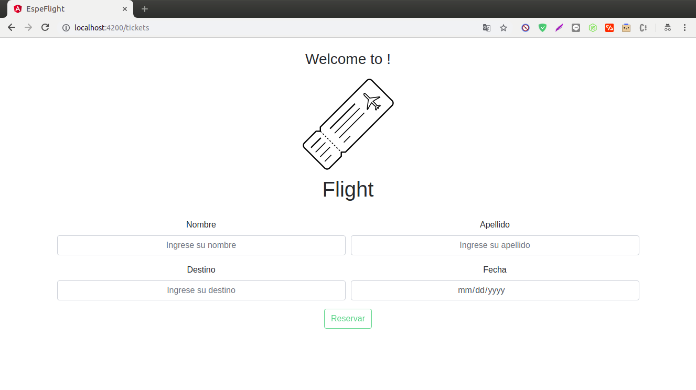

# EspeFlight

This project was generated with [Angular CLI](https://github.com/angular/angular-cli) version 6.2.9.

## Pasos

* git clone proyect
* ingresar a la carpeta del proyecto
* ejecutar en la consola npm install

## Development server

Run `ng serve` for a dev server. Navigate to `http://localhost:4200/`. The app will automatically reload if you change any of the source files.

## FUNCIONAMENTO

1.- Formulario publico

2. Vistas Supervisor

